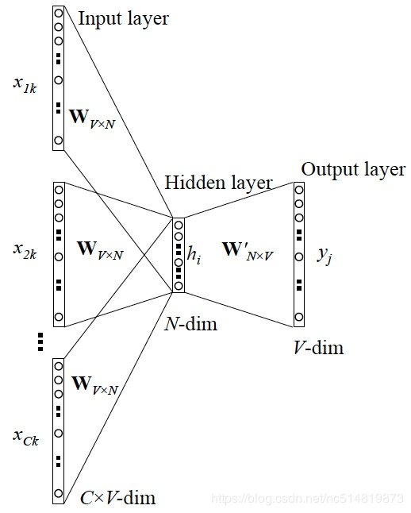
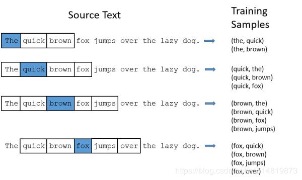

#任务
1. 文本表示：从one-hot到word2vec。

1.1 词袋模型：离散、高维、稀疏。

1.2 分布式表示：连续、低维、稠密。word2vec词向量原理并实践，用来表示文本。

文本表示的意思是把字词处理成向量或矩阵，以便计算机能进行处理。文本表示是自然语言处理的开始环节。

文本表示按照细粒度划分，一般可分为字级别、词语级别和句子级别的文本表示。

## 1.1 one-hot
one-hot向量表示为ti=[0,0,0,...,1,...0] ti=[0,0,0,...,1,...0]ti=[0,0,0,...,1,...0]，长度等于特征数目。

one-hot向量是词向量表示中最简单常用的方式,在特征提取上属于词袋模型。这个向量的表示为一项属性的特征向量，也就是同一时间只有一个激活点（不为0），这个向量只有一个特征是不为0的，其他都是0。

**优点**：

1）是解决了分类器不好处理离散数据的问题，

2）是在一定程度上也起到了扩充特征的作用（上面样本特征数从3扩展到了9）

**缺点**：在文本特征表示上有些缺点就非常突出了。

1）它是一个词袋模型，不考虑词与词之间的顺序（文本中词的顺序信息也是很重要的）；

2）它假设词与词相互独立（在大多数情况下，词与词是相互影响的）；

3）它得到的特征是离散稀疏的。

## 1.2 word2vec

word2vec模型其实就是简单化的神经网络。

既然是神经网络，那么就有对应的输入层，隐层与输出层。

输入就是上边提到的One-Hot Vector，隐层没有激活函数，只是线性的单元。

输出层维度跟输入层一样，用的是Softmax回归。

当这个模型训练好以后，我们并不会用这个训练好的模型处理新的任务，我们真正需要的是这个模型通过训练数据所学得的参数，例如隐层的权重矩阵。

那么这个模型是如何定义数据的输入和输出呢？

一般分为CBOW(Continuous Bag-of-Words 与Skip-Gram两种模型。

CBOW模型的训练输入是某一个特征词的上下文相关的词对应的词向量，而输出就是这特定的一个词的词向量。

Skip-Gram模型和CBOW的思路是反着来的，即输入是特定的一个词的词向量，而输出是特定词对应的上下文词向量。

CBOW对小型数据库比较合适，而Skip-Gram在大型语料中表现更好。

### 1.2.1 CBOW
CBOW的训练模型如图所示



1 输入层：上下文单词的onehot. {假设单词向量空间dim为V，上下文单词个数为C}

2 所有onehot分别乘以共享的输入权重矩阵W. {VN矩阵，N为自己设定的数，初始化权重矩阵W}

3 所得的向量 {因为是onehot所以为向量} 相加求平均作为隐层向量, size为1N.

4 乘以输出权重矩阵W’ {NV}

5 得到向量 {1V} 激活函数处理得到V-dim概率分布 {PS: 因为是onehot嘛，其中的每一维斗代表着一个单词}

6 概率最大的index所指示的单词为预测出的中间词（target word）与true label的onehot做比较，误差越小越好（根据误差更新权重矩阵）
所以，需要定义loss function（一般为交叉熵代价函数），采用梯度下降算法更新W和W’。

训练完毕后，输入层的每个单词与矩阵W相乘得到的向量的就是我们想要的词向量（word embedding），这个矩阵（所有单词的word embedding）也叫做look up table（其实聪明的你已经看出来了，其实这个look up table就是矩阵W自身），也就是说，任何一个单词的onehot乘以这个矩阵都将得到自己的词向量。

有了look up table就可以免去训练过程直接查表得到单词的词向量了。


## 1.2.2 Skip-Gram
从直观上理解，Skip-Gram是给定input word来预测上下文。

接下来我们来看看如何训练我们的神经网络。假如我们有一个句子“The dog barked at the mailman”。

首先我们选句子中间的一个词作为我们的输入词，例如我们选取“dog”作为input word；
有了input word以后，我们再定义一个叫做skip_window的参数，它代表着我们从当前input word的一侧（左边或右边）选取词的数量。

如果我们设置skip_window=2，那么我们最终获得窗口中的词（包括input word在内）就是[‘The’, ‘dog’，‘barked’, ‘at’]。

skip_window=2代表着选取左input word左侧2个词和右侧2个词进入我们的窗口，所以整个窗口大小span=2x2=4。

另一个参数叫num_skips，它代表着我们从整个窗口中选取多少个不同的词作为我们的output word，当skip_window=2，num_skips=2时，我们将会得到两组 (input word, output word) 形式的训练数据，即 (‘dog’, ‘barked’)，(‘dog’, ‘the’)。

神经网络基于这些训练数据将会输出一个概率分布，这个概率代表着我们的词典中的每个词是output word的可能性。这句话有点绕，我们来看个栗子。

第二步中我们在设置skip_window和num_skips=2的情况下获得了两组训练数据。假如我们先拿一组数据 (‘dog’, ‘barked’) 来训练神经网络，那么模型通过学习这个训练样本，会告诉我们词汇表中每个单词是“barked”的概率大小。

模型的输出概率代表着到我们词典中每个词有多大可能性跟input word同时出现。举个栗子，如果我们向神经网络模型中输入一个单词“中国“，那么最终模型的输出概率中，像“英国”， ”俄罗斯“这种相关词的概率将远高于像”苹果“，”蝈蝈“非相关词的概率。因为”英国“，”俄罗斯“在文本中更大可能在”中国“的窗口中出现。

我们将通过给神经网络输入文本中成对的单词来训练它完成上面所说的概率计算。

面的图中给出了一些我们的训练样本的例子。

我们选定句子“The quick brown fox jumps over lazy dog”，设定我们的窗口大小为2（window_size=2），也就是说我们仅选输入词前后各两个词和输入词进行组合。

下图中，蓝色代表input word，方框内代表位于窗口内的单词。Training Samples（输入， 输出）



我们的模型将会从每对单词出现的次数中习得统计结果。

例如，我们的神经网络可能会得到更多类似（“中国“，”英国“）这样的训练样本对，而对于（”英国“，”蝈蝈“）这样的组合却看到的很少。

因此，当我们的模型完成训练后，给定一个单词”中国“作为输入，输出的结果中”英国“或者”俄罗斯“要比”蝈蝈“被赋予更高的概率。

再次提醒，最终我们需要的是训练出来的权重矩阵。

论文：Efficient Estimation of Word Representations in Vector Space

# 2. word2vec实践
关于word2vec的使用还在摸索中，这里先找一个简单的例子。

```angular2

import logging
import gensim
from gensim.models import word2vec

# 设置输出日志
logging.basicConfig(format='%(asctime)s : %(levelname)s : %(message)s', level=logging.INFO)

# 直接用gemsim提供的API去读取txt文件，读取文件的API有LineSentence 和 Text8Corpus, PathLineSentences等。
sentences = word2vec.LineSentence("G:/PycharmCode/NLP/matextract_1/spacy_v1/all.txt")

# 训练模型，词向量的长度设置为200， 迭代次数为8，采用skip-gram模型，模型保存为bin格式
model = gensim.models.Word2Vec(sentences, size=200, sg=1, iter=8)
model.wv.save_word2vec_format("./word2Vec" + ".bin", binary=True)
```

参考：https://blog.csdn.net/tulingmenghuan/article/details/89467012


