## 1. 前馈神经网络、网络层数、输入层、隐藏层、输出层、隐藏单元、激活函数的概念。
1.1 前馈神经网络
>神经网络学习模型是由各神经元模型组成的并行互连的机器学习模型，发展到今天，神经网络模型已经有多种繁杂的变种，下面先介绍最常用的也是基础的前馈神经网络。

1.2 网络层数
>通常网络层数指的是除去输入层外的网络层数，即隐藏层与输出层的层数之和。

1.3 输入层[inut layer]
>众多神经元（Neuron）接受大量非线形输入消息。输入的消息称为输入向量。

1.4 隐藏层[hidden layer]
>简称“隐层”，是输入层和输出层之间众多神经元和链接组成的各个层面。隐层可以有一层或多层。隐层的节点（神经元）数目不定，但数目越多神经网络的非线性越显著，从而神经网络的强健性（robustness）（控制系统在一定结构、大小等的参数摄动下，维持某些性能的特性）更显著。

1.5 输出层[output layer]
>消息在神经元链接中传输、分析、权衡，形成输出结果。输出的消息称为输出向量。

1.6 激活函数
>如果没有激活函数，每一层节点的输入都是上层输出的线性函数，无论神经网络有多少层，输出都只是输入的简单的线性组合，与没有隐藏层效果相当，也就是最原始的感知机（Perceptron）。所以，引入非线性函数作为激活函数，这样深层神经网络表达能力就更加强大。
目前，常用的激活函数有sigmoid函数，tanh函数，**Relu**函数及Relu的一些改进函数。

## 2. 感知机相关；利用tensorflow等工具定义简单的几层网络（激活函数sigmoid），递归使用链式法则来实现反向传播。
## 3. 激活函数的种类以及各自的提出背景、优缺点。（和线性模型对比，线性模型的局限性，去线性化）
3.1 Sigmoid函数

>Sigmoid又叫作 Logistic 激活函数，它将实数值压缩进 0 到 1 的区间内，还可以在预测概率的输出层中使用。该函数将大的负数转换成 0，将大的正数转换成 1。数学公式为：
σ(x)=1/(1+e^(-x) )
其图像为：

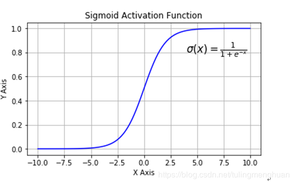

Sigmoid 函数的三个主要缺陷：
1) 梯度消失： Sigmoid 函数趋近 0 和 1 的时候变化率会变得平坦，也就是说，Sigmoid 的梯度趋近于 0。神经网络使用 Sigmoid 激活函数进行反向传播时，输出接近 0 或 1 的神经元其梯度趋近于 0。这些神经元叫作饱和神经元。因此，这些神经元的权重不会更新。此外，与此类神经元相连的神经元的权重也更新得很慢。该问题叫作**梯度消失**。因此，如果一个大型神经网络包含 Sigmoid 神经元，而其中很多个都处于饱和状态，那么该网络无法执行反向传播。
2) 不以零为中心：Sigmoid 输出不以零为中心的。
3) 计算成本高昂：Sigmoid函数与其他非线性激活函数相比，保护指数计算，计算成本高昂。

3.2tanh函数
tanh 激活函数又叫作双曲正切激活函数。与Sigmoid函数类似，Tanh函数也使用真值，但Tanh函数将其压缩至-1到1的区间内。与Sigmoid 不同，Tanh 函数的输出以零为中心，因为区间在-1 到 1 之间。数学公式为：

tanh(x)=(ex-e(-x))/(ex+e(-x) )
其图像为：

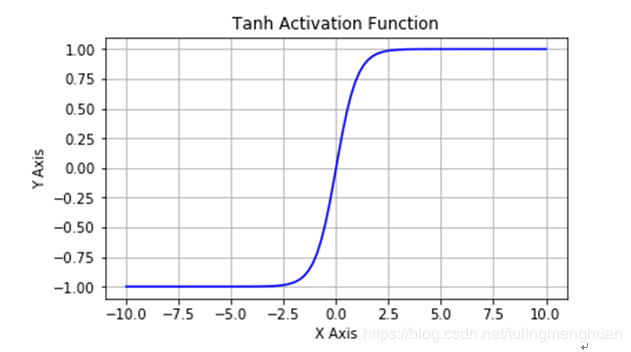

唯一的缺点是：

1) Tanh 函数也会有梯度消失的问题，因此在饱和时也会“杀死”梯度。

3.3ReLU函数

ReLU 是从底部开始半修正的一种函数。数学公式为：
f(x)=max(0,x)
其图像为：

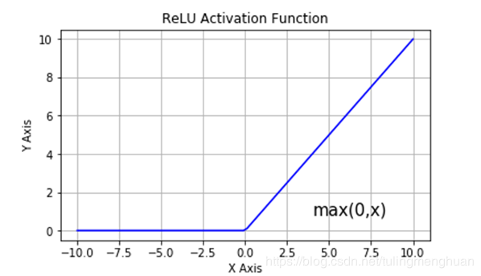

当输入 x<0 时，输出为 0，当 x> 0 时，输出为 x。该激活函数使网络更快速地收敛。它不会饱和，即它可以对抗梯度消失问题，至少在正区域（x> 0 时）可以这样，因此神经元至少在一半区域中不会把所有零进行反向传播。由于使用了简单的阈值化（thresholding），ReLU 计算效率很高。但是 ReLU 神经元也存在一些缺点：

1).不以零为中心：和 Sigmoid 激活函数类似，ReLU 函数的输出不以零为中心。

2).前向传导（forward pass）过程中，如果 x < 0，则神经元保持非激活状态，且在后向传导（backward pass）中「杀死」梯度。这样权重无法得到更新，网络无法学习。当 x = 0 时，该点的梯度未定义，但是这个问题在实现中得到了解决，通过采用左侧或右侧的梯度的方式。

## 4. 深度学习中的正则化（参数范数惩罚：L1正则化、L2正则化；数据集增强；噪声添加；early stop；Dropout层）、正则化的介绍。

>正则化技术是保证**算法泛化能力**的有效工具，因此算法正则化的研究成为机器学习中主要的研究主题。此外，正则化还是训练参数数量大于训练数据集的深度学习模型的关键步骤。正则化可以避免算法过拟合，过拟合通常发生在算法学习的输入数据无法反应真实的分布且存在一些噪声的情况。过去数年，研究者提出和开发了多种适合机器学习算法的正则化方法，如数据增强、L2 正则化（权重衰减）、L1 正则化、Dropout、Drop Connect、随机池化和早停等。

4.1数据增强

>数据增强是提升算法性能、满足深度学习模型对大量数据的需求的重要工具。数据增强通过向训练数据添加转换或扰动来人工增加训练数据集。数据增强技术如水平或垂直翻转图像、裁剪、色彩变换、扩展和旋转通常应用在视觉表象和图像分类中。

4.2L1 和 L2 正则化

>L1 和 L2 正则化是最常用的正则化方法。L1 正则化向目标函数添加正则化项，以减少参数的绝对值总和；而 L2 正则化中，添加正则化项的目的在于减少参数平方的总和。根据之前的研究，L1 正则化中的很多参数向量是稀疏向量，因为很多模型导致参数趋近于 0，因此它常用于特征选择设置中。

>机器学习中最常用的正则化方法是对权重施加 L2 范数约束。

>标准正则化代价函数

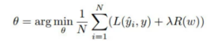

其中正则化项 R(w) 是：
L2正则化：

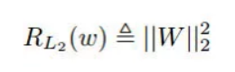

L1正则化:

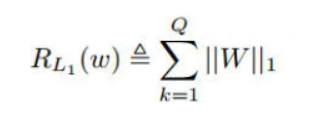

4.3Dropout(随机失活)

>Dropout 指暂时丢弃一部分神经元及其连接。随机丢弃神经元可以防止过拟合，同时指数级、高效地连接不同网络架构。神经元被丢弃的概率为 1 − p，减少神经元之间的共适应。隐藏层通常以 0.5 的概率丢弃神经元。使用完整网络（每个节点的输出权重为 p）对所有 2^n 个 dropout 神经元的样本平均值进行近似计算。Dropout 显著降低了过拟合，同时通过避免在训练数据上的训练节点提高了算法的学习速度。

4.4早停法（stop early）

>早停法可以限制模型最小化代价函数所需的训练迭代次数。早停法通常用于防止训练中过度表达的模型泛化性能差。如果迭代次数太少，算法容易欠拟合（方差较小，偏差较大），而迭代次数太多，算法容易过拟合（方差较大，偏差较小）。早停法通过确定迭代次数解决这个问题，不需要对特定值进行手动设置。

2.5正则化的介绍

[推荐参考](https://zhuanlan.zhihu.com/p/29360425)

## 5. 深度模型中的优化：参数初始化策略；自适应学习率算法（梯度下降、AdaGrad、RMSProp、Adam；优化算法的选择）；batch norm层（提出背景、解决什么问题、层在训练和测试阶段的计算公式）；layer norm层。

5.1参数初始化策略

>神经网络的训练过程中的参数学习是基于梯度下降法进行优化的。梯度下降法需要在开始训练时给每一个参数赋一个初始值。这个初始值的选取十分关键。一般我们希望数据和参数的均值都为 0，输入和输出数据的方差一致。在实际应用中，参数服从高斯分布或者均匀分布都是比较有效的初始化方式。

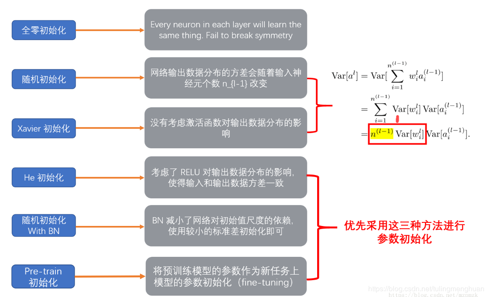

5.1.2原理

>为了使得在经过多层网络后，信号不被过分放大或过分减弱，我们尽可能保持 每个神经元的输入和输出的方差一致。

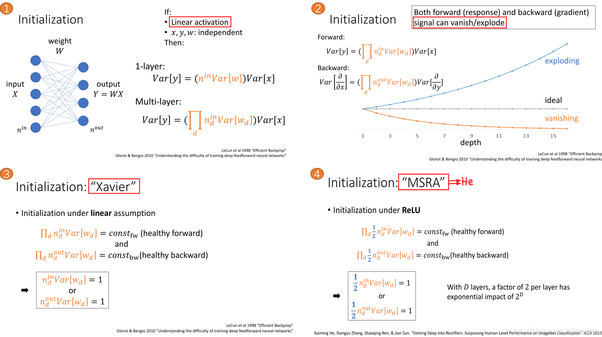

>使用 RELU（without BN） 激活函数时，最好选用 He 初始化方法，将参数初始化为服从高斯分布或者均匀分布的较小随机数
使用 BN 时，减少了网络对参数初始值尺度的依赖，此时使用较小的标准差(eg：0.01)进行初始化即可
借助预训练模型中参数作为新任务参数初始化的方式也是一种简便易行且十分有效的模型参数初始化方法

参考链接:https://blog.csdn.net/mzpmzk/article/details/79839047

5.3.自适应学习率算法

>随机梯度下降的优化算法是机器学习和深度学习中的核心优化算法。该领域中的许多问题都可以看作是最大化和最小化一个参数化的损失函数，在大多数情况下损失函数本身是可微的，由于问题数据规模极大，所以一般情况下获得二阶信息是很难的，存储相应的二阶信息也是消耗非常大的一件事，所以梯度下降，这样一种仅仅要求一阶偏导数的优化算法在这些问题上很有效。而在深度学习领域，即使数据集和网络模型架构完全相同，使用不同的优化算法，也可能得到相差非常大的最终结果，此外，在数据收集和采样进行训练的时候可能会有比较严重的噪声影响，简单的梯度下降方法往往无法奏效，因此，为了弥补朴素梯度下降的种种缺陷，就需要一系列对梯度下降系列优化算法的的改进，也就因此诞生了SGD with momentum， Adagrad，RMSprop，Adam等一系列变种自适应学习率算法。

5.4朴素SGD及mini-batch SGD

>朴素SGD即最基本的最速下降法，使用一个梯度步作为方向，步长作为一个可调控因子随时调整，那么可简单写为

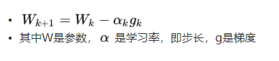

>在深度学习的实践当中，通常选择学习率是一个根据迭代次数逐渐衰减的量，即给定一个初始学习率然后让它随时迭代次 数逐渐衰减，或者是训练到一定迭代次数后进行衰减。朴素的SGD的问题就是其收敛速度非常慢，而且容易陷入局部最优点和鞍点，很难从其中逃出。同时，由于学习率在实践中往往是根据经验来调整，而一个合适的学习率调整策略对整个问题的优化过程是十分重要的，所以如何选择这样合适的学习率更是SGD的最大难点。

>在深度学习环境下，我们有非常多的训练数据，朴素的想法是对每一个数据使用SGD更新一次，这样能获得很好的对数据的泛化能力，但是与之而相对的，如果数据的分布极不均衡，数据中有很多的噪声，那么这样的策略将会“带偏”我们的模型，因此，一个自然而然的想法就是每次使用一批数据（batch）来计算梯度，然后将梯度平均之后再使用SGD去更新参数，通过平均一批样本的梯度结果来减少震荡和其他影响，这就是所谓的mini-batch SGD的基本思想。在实际操作中，batch的大小一般根据计算资源的存储能力，训练时间开销，泛化能力要求综合来定，**batch越小泛化能力越强**，但时间开销就大且容易发生震荡，**batch越大训练速度越快但是可能丧失一定的泛化能力**，所以一般使用权衡两边的mini-batch。

5.5 SGD with momentum

>上文中提到朴素SGD收敛速度很慢且容易震荡，借用物理中动量的概念，我们希望结合历史的梯度信息和当前梯度信息来共同指导更新，通俗来讲，就是遇到陡坡时，希望运动得更快，遇到复杂的沟壑时，希望借助之前的惯性尽快冲出，遇到突然变化的情况，也希望由于惯性的作用方向不要变化太大。借由以上直觉和概念，就产生带有动量的梯度下降，即SGD with momentum，其表达式为：

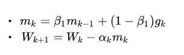

>这里β1是一个加权因子，一般取0.9，这个形式其实就是对历史的梯度信息做因子为 \beta_1 的指数加权平均，然后结合当前的梯度信息构成下一步更新的方向，由于这个因子大于0.5，这就意味着下降方向主要是此前累积的下降方向，然后略微偏向当前时刻的梯度方向。这样的一种改进，使得参数中那些梯度方向变化不大的维度可以加速更新，同时减少梯度方向变化较大的维度上的更新幅度，由此产生了加速收敛和减小震荡的效果。

5.6 Adagrad

>之前我们提到的优化算法都是对整个模型的所有参数，以相同的学习率去更新，但是深度学习模型是非常大的，往往有上亿个参数，采用统一的学习率是一种很简单粗暴的策略。而在不同的任务中，不同的网络层的参数所需要的更新频率往往有所区别。对于那些更新不频繁的参数，我们了解到的信息较少，所以希望每次更新时单次步长更大，能够多学习到一些知识，同时对于那些更新非常频繁的参数，我们已经累积了大量关于它的学习经验和知识，所以希望采用较小的步长，不要被一部分样本影响过大，能够学到更稳定的参数值。由此，我们需要一个量来衡量历史更新频率，直观的想法就是二阶动量，即某一维上，迄今为止所有梯度值的平方和，可以写作：
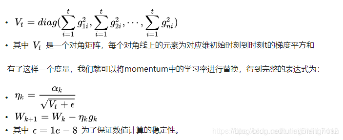

> 对于以前更新频繁的参数，其二阶动量对应的分量就比较大，所以对应的学习率就较小，反之就较大。Adagrad也可以说是进入所谓“自适应学习率”的时代

5.7 RMSprop

>对于Adagrad，有一个很明显的问题，就是V_t 是一个只会累积增加的量，即是单调递增的，这在稀疏数据场景下表现非常好，但是对于稠密的数据集，这会导致学习率在训练的中后期单调递减至0，对于后续的训练样本，由于学习率已经接近于0，所以模型很难学到新的必要的知识。因此，我们需要对Adagrad做一定的修正，借鉴momentum中对历史信息的处理方式，我们对于二阶动量也采用指数加权平均的方法来处理，不累积全部的历史梯度，而只关注最近某一时间窗口内的梯度累积量，由此便得到了RMSprop：
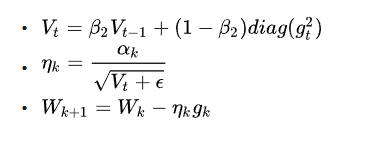

5.8 Adam

>在上面的方法中我们讲到了基于一阶动量和二阶动量的改进方法，那么如果将他们结合起来呢，Adam就是这样一种结合两者的改进优化算法，也是整个SGD系列的集大成者，既包含来自momentum的累积历史梯度对方向的修正，又包含来自RMSprop的对于学习率的修正，最终的完整表达式如下

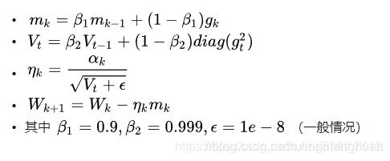

5.8. batch norm层

>因为深层神经网络在做非线性变换前的激活输入值（就是那个x=WU+B，U是输入）随着网络深度加深或者在训练过程中，其分布逐渐发生偏移或者变动，之所以训练收敛慢，一般是整体分布逐渐往非线性函数的取值区间的上下限两端靠近（对于Sigmoid函数来说，意味着激活输入值WU+B是大的负值或正值），所以这**导致反向传播时低层神经网络的梯度消失**，这是训练深层神经网络收敛越来越慢的本质原因。
BN就是通过一定的规范化手段，把每层神经网络任意神经元这个输入值的分布强行拉回到均值为0方差为1的标准正态分布，其实就是把越来越偏的分布强制拉回比较标准的分布，这样使得激活输入值落在非线性函数对输入比较敏感的区域，这样输入的小变化就会导致损失函数较大的变化，意思是这样让**梯度变大，避免梯度消失问题产生，而且梯度变大意味着学习收敛速度快，能大大加快训练速度**。
对于每个隐层神经元，把逐渐向非线性函数映射后向取值区间极限饱和区靠拢的输入分布强制拉回到均值为0方差为1的比较标准的正态分布，使得非线性变换函数的输入值落入对输入比较敏感的区域，以此避免梯度消失问题。因为梯度一直都能保持比较大的状态，所以很明显对神经网络的参数调整效率比较高，就是变动大，就是说向损失函数最优值迈动的步子大，也就是说收敛地快。

5.8.1 训练阶段如何做BatchNorm

假设对于一个深层神经网络来说，其中两层结构如下

>要对每个隐层神经元的激活值做BN，可以想象成每个隐层又加上了一层BN操作层，它位于X=WU+B激活值获得之后，非线性函数变换之前，其图示如下：

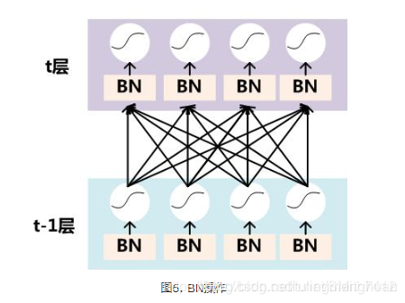

>对于Mini-Batch SGD来说，一次训练过程里面包含m个训练实例，其具体BN操作就是对于隐层内每个神经元的激活值来说，进行如下变换：

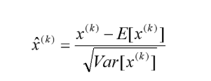

>变换的意思是：某个神经元对应的原始的激活x通过减去mini-Batch内m个实例获得的m个激活x求得的均值E(x)并除以求得的方差Var(x)来进行转换。
经过这个变换后某个神经元的激活x形成了均值为0，方差为1的正态分布，目的是把值往后续要进行的非线性变换的线性区拉动，增大导数值，增强反向传播信息流动性，加快训练收敛速度。但是这样会导致网络表达能力下降，为了防止这一点，每个神经元增加两个调节参数（scale和shift），这两个参数是通过训练来学习到的，用来对变换后的激活反变换，使得网络表达能力增强，即对变换后的激活进行如下的scale和shift操作，这其实是变换的反操作：

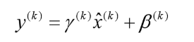

具体操作流程：

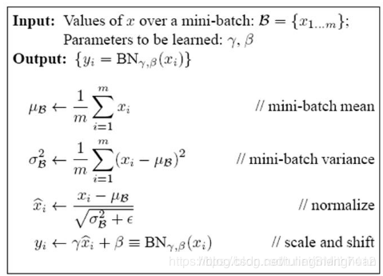

BN的好处：

①不仅仅极大提升了训练速度，收敛过程大大加快；

②还能增加分类效果，一种解释是这是类似于Dropout的一种防止过拟合的正则化表达方式，所以不用Dropout也能达到相当的效果；

③另外调参过程也简单多了，对于初始化要求没那么高，而且可以使用大的学习率等。

6.layer norm层

>主要是针对 batch normalization 存在的问题 提出了 Layer Normalization 进行改进的。
注意到一层输出的改变会产生下一层输入的高相关性改变，特别是当使用 ReLU,其输出改变很大。那么我们可以通过固定一层神经元的输入均值和方差来降低 covariate shift 的影响。

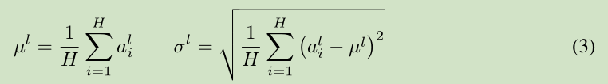

>上面公式中 H 是 一层神经元的个数。这里一层网络 共享一个均值和方差，不同训练样本对应不同的均值和方差，这是和 Batch normalization 的最大区别。
Layer normalization 对于recurrent neural networks 的帮助最大， 对于 Convolutional Networks 作用不是很大。

参考：https://blog.csdn.net/tulingmenghuan/article/details/89424772