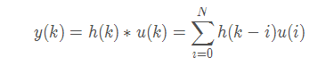
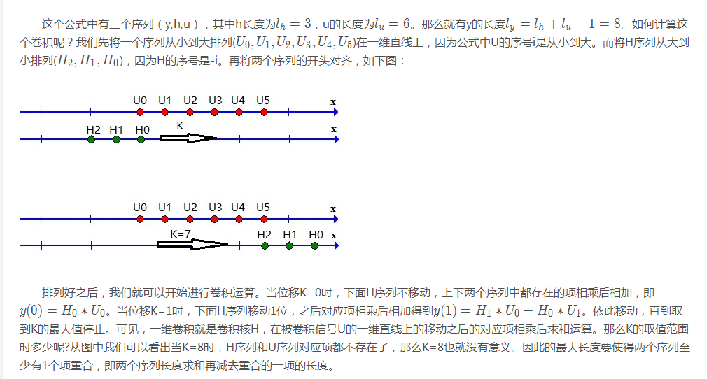
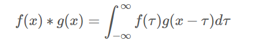
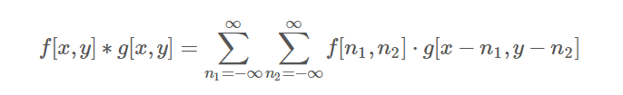
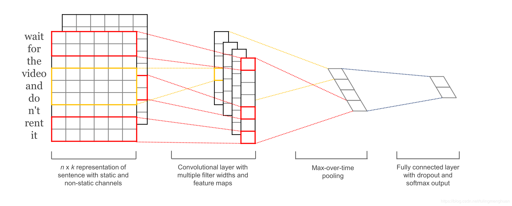
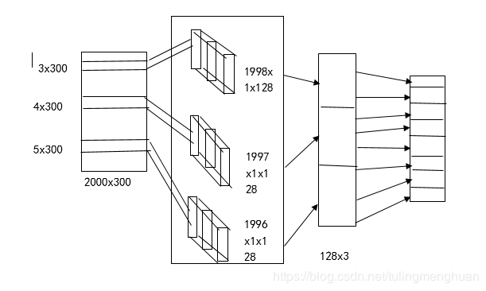

1. 卷积运算的定义、动机（稀疏权重、参数共享、等变表示）。一维卷积运算和二维卷积运算。

2. 反卷积(tf.nn.conv2d_transpose)

3. 池化运算的定义、种类（最大池化、平均池化等）、动机。

4. Text-CNN的原理。

5. 利用Text-CNN模型来进行文本分类

## 1.1 卷积运算的定义

所谓卷积，其实是一种数学运算。但是在我们的学习生涯中，往往它都是披上了一层外衣，使得我们经常知其然不知其所以然。比如在信号系统中，他是以一维卷积的形式出现描述系统脉冲响应。

又比如在图像处理中，他是以二维卷积的形式出现，可以对图像进行模糊处理。乍一看，两个形式风马牛不相及，但其实他们的本质都是统一的。

可见，我们看待事物不仅要看他们的表象，还要从表象中分辨出他们的本质。下面进入正题。

卷积网络，也叫卷积神经网络(CNN)，是一种专门依赖处理具有类似网络结构的数据的神经网络。卷积是一种特殊的线性运算。卷积网络是指那些至少在网络的一层中使用卷积运算来代替一般的矩阵乘法运算的神经网络。

卷积运算,在通常形式中，卷积是对两个变体函数的一种数学运算数据是。卷积运算对输入数据应用滤波器，例子：输入数据是有高长方向的形状的数据，滤波器也一样，有高长方向上的维度，假设用height,weight,表示数据和滤波器的形状，“核”又称滤波器。

卷积运算以一定间隔滑动滤波器的窗口并应用，将各个位置上的滤波器的元素 和输入的对应元素相乘，然后现求和（有时这个运算称为乘积累积运算），然后，将这个结果保存到输出的对应位，将这个过程在所有位置都进行一遍，就可以得到卷积运算的输出。

例如：我们称 (f*g)(n) 为 f,g 的卷积其连续的定义为：


其离散的定义为:


1.2 卷积运算的优点

  卷积运算通过三个重要的思想来帮助改进机器学习系统：稀疏交互、参数共享、等变表示。

另外，卷积提供了一种处理大小可变的输入的方法。卷积网络具有稀疏交互（也叫稀疏连接或者稀疏权重）的特征。

1.2.1 稀疏连接

传统的神经网络使用全连接（矩阵运算），进行输入数据和输出数据之间的连接。其中，参数矩阵中每一个单独的参数都描述了一个输入单元和一个输出单元之间的链接，假设输入单元的数目为 m，输出单元的数目为n，则进行转换的参数矩阵数目为m∗n。当m和n非常大的时候，必然带来一个非常大的内存开销。
  

但是卷积神经网络核函数的存在，我们只需要检测当前时刻核函数所覆盖的范围内，假设核函数的宽度为k，输出单元的宽度为n，则需要的参数矩阵数目为k∗n，一般情况下，核函数的宽度要远小于输入函数的宽度，这不仅减少了模型参数存储的需求，还增快了统计效率。

1.2.2 参数共享

  参数共享是指在一个模型的多个函数中使用相同的参数。在传统的神经网络中，每一个参数仅仅使用一次，对应着固定的输入和输出神经元，比如参数wi,j
​	
 表示第i个输入神经元和第j个输出神经元之间的连接权重。而卷积神经网络中的参数共享保证了我们只需要学习到一个卷积核函数，而不是像全连接神经网络一样在每个位置都学习一个卷积核函数。
 
 这虽然没有改变前向传播的计算时间，但是它显著的减少了参数的数目。

1.2.3 等变表示

  参数共享的特殊形式使得神经网络具有平移等变的性质。

If一个函数满足输入改变，输出也以同样的方式改变的这一性质，我们就说它是等变的(equivariant).

特别的是：如果函数f(x)和g(x）满足这个性质： f(g(x))=g(f(x))，那么我们就说f(x)对于g(x)具有等变性。


## 1.3 一维卷积运算和二维卷积运算

1.3.1 一维卷积

在这个部分，我们主要从数学的角度看一看卷积，也就是看一下卷积是怎么运算的。这里要说明一下，卷积分为连续卷积和离散卷积。

在此为了方便大家理解，在此先以离散卷积举例，本文也就不再专门讨论连续卷积（因为连续卷积和离散卷积的区别也就是连续和离散的区别，找时间我会总结一下连续和离散的异同）。

说到数学角度，那首先就要给出卷积运算的公式定义：





维基百科上，卷积的形式化定义如下



```angular2
conv1d(value,filters, stride, padding, use_cudnn_on_gpu=None, data_format=None, name=None)
```

**二维卷积运算**

数学定义



```angular2
conv2d(input, filter, strides, padding, use_cudnn_on_gpu=True, data_format="NHWC", dilations=[1, 1, 1, 1], name=None)

```

# 2.反卷积(tf.nn.conv2d_transpose)

反卷积操作是卷积的反向,反卷积通常用于将低维特征映射成高维输入，与卷积操作的作用相反.

反卷积和卷积基本一致，差别在于，反卷积需要填充过程，并在最后一步需要裁剪。

```
conv2d_transpose(value, filter, output_shape, strides, padding="SAME", data_format="NHWC", name=None)
```
除去name参数用以指定该操作的name，与方法有关的一共六个参数：

第一个参数value：指需要做反卷积的输入图像，它要求是一个Tensor

第二个参数filter：卷积核，它要求是一个Tensor，具有[filter_height, filter_width, out_channels, in_channels]这样的shape，具体含义是[卷积核的高度，卷积核的宽度，卷积核个数，图像通道数]

第三个参数output_shape：反卷积操作输出的shape，细心的同学会发现卷积操作是没有这个参数的，那这个参数在这里有什么用呢？下面会解释这个问题

第四个参数strides：反卷积时在图像每一维的步长，这是一个一维的向量，长度4

第五个参数padding：string类型的量，只能是"SAME","VALID"其中之一，这个值决定了不同的卷积方式

第六个参数data_format：string类型的量，'NHWC’和’NCHW’其中之一，这是tensorflow新版本中新加的参数，它说明了value参数的数据格式。

'NHWC’指tensorflow标准的数据格式[batch, height, width, in_channels]，
‘NCHW’指Theano的数据格式,[batch, in_channels，height, width]，当然默认值是’NHWC’

## 3.池化运算的定义、种类（最大池化、平均池化等）、动机。

3.1 池化运算的定义

池化函数使用某一位置的相邻输出的总体统计特征来代替网络在该位置的输出。

3.2池化运算的种类

通常使用的池化操作包括平均值池化和最大值池化。
**平均池化：**计算图像区域的平均值作为该区域池化后的值。
**最大池化：**选图像区域的最大值作为该区域池化后的值。

```angular2
tf.nn.max_pool(value, ksize, strides, padding, data_format='NHWC', name=None)

```

除此之外，还有重叠池化和空金字塔池化

**重叠池化**：相邻池化窗口之间会有重叠区域，此时sizeX>stride
空间金字塔池化可以把任何尺度的图像的卷积特征转化成相同维度，这不仅可以让CNN处理任意尺度的图像，还能避免cropping和warping操作，导致一些信息的丢失，具有非常重要的意义。

3.3 池化运算的动机

池化操作得到的结果相比其输入降小了，其实池化操作实际上就是一种 **“降采样”**操作。另一方面，池化也可以看成是一个用 p范数作为非线性映射的“卷积”操作，特别的，当 p 趋近正无穷时就是最常见的最大值池化。池化层的引入是仿照人的视觉系统对视觉输入对象进行降维（降采样）和抽象。
其具有三个特性：特征不变性，特征降维，在一定程度防止过拟合，更方便优化。

## 4. Text-CNN的原理。

4.1简介

TextCNN 是利用卷积神经网络对文本进行分类的算法，由 Yoon Kim 在 “Convolutional Neural Networks for Sentence Classification” 一文中提出.





1、首先输入层，将文本经过embedding之后形成了一个2000300的维度，其中2000为文本最大长度、300为词向量的维度。

2、卷积层，卷积层设计三个不同大小的卷积核，【3300，4300，5300】，每个不同大小的卷积核各128个。卷积后分别成为【19981128，19971128，19961128】的feture-map，这里为什么会变成大小这样的，是因为tensorflow的卷积方式采用same 或者 valid的形式，这种卷积的方式采用的是valid 具体大家可以看看官方文档。

3、经过卷积之后，随后是三个池化层，池化层的目的是缩小特征图，这里同池化层的设置，将卷积层的特征池化之后的图为【11128，11128，1128】，经过reshape维度合并成【3*128】。

4、全连接层就不必说，采用softmax就可以解决了。


## 5.利用Text-CNN模型来进行文本分类

```angular2
import tensorflow as tf
import numpy as np


class Settings(object):
    """
    configuration class
    """
    def __init__(self, vocab_size=100000, embedding_size=128):
        self.model_name = "CNN"
        self.embedding_size = embedding_size
        self.filter_size = [2, 3, 4, 5]
        self.n_filters = 128
        self.fc_hidden_size = 1024
        self.n_class = 2
        self.vocab_size = vocab_size
        self.max_words_in_doc = 20

class TextCNN(object):
    """
    Text CNN
    """
    def __init__(self, settings, pre_trained_word_vectors=None):
        self.model_name  = settings.model_name
        self.embedding_size = settings.embedding_size
        self.filter_size = settings.filter_size
        self.n_filter = settings.n_filters
        self.fc_hidden_size = settings.fc_hidden_size
        self.n_filter_total = self.n_filter*(len(self.filter_size))
        self.n_class = settings.n_class
        self.max_words_in_doc = settings.max_words_in_doc
        self.vocab_size = settings.vocab_size


        """ 定义网络的结构 """
        # 输入样本
        with tf.name_scope("inputs"):
            self._inputs_x = tf.placeholder(tf.int64, [None, self.max_words_in_doc], name="_inputs_x")
            self._inputs_y = tf.placeholder(tf.float16, [None, self.n_class], name="_inputs_y")
            self._keep_dropout_prob = tf.placeholder(tf.float32, name="_keep_dropout_prob")

        # 嵌入层
        with tf.variable_scope("embedding"):
            if  isinstance( pre_trained_word_vectors,  np.ndarray):  # 使用预训练的词向量
                assert isinstance(pre_trained_word_vectors, np.ndarray), "pre_trained_word_vectors must be a numpy's ndarray"
                assert pre_trained_word_vectors.shape[1] == self.embedding_size, "number of col of pre_trained_word_vectors must euqals embedding size"
                self.embedding = tf.get_variable(name='embedding', 
                                                 shape=pre_trained_word_vectors.shape,
                                                 initializer=tf.constant_initializer(pre_trained_word_vectors), 
                                                 trainable=True)
            else:
                self.embedding = tf.Variable(tf.truncated_normal((self.vocab_size, self.embedding_size)))


        # conv-pool
        inputs = tf.nn.embedding_lookup(self.embedding, self._inputs_x)  #[batch_size, words, embedding]  # look up layer
        inputs = tf.expand_dims(inputs, -1) # [batch_size, words, embedding, 1]
        pooled_output = []

        for i, filter_size in enumerate(self.filter_size): # filter_size = [2, 3, 4, 5]
            with tf.variable_scope("conv-maxpool-%s" % filter_size):
                # conv layer
                filter_shape = [filter_size, self.embedding_size, 1, self.n_filter]
                W = self.weight_variable(shape=filter_shape, name="W_filter")
                b = self.bias_variable(shape=[self.n_filter], name="b_filter")
                conv = tf.nn.conv2d(inputs, W, strides=[1, 1, 1, 1], padding="VALID", name='text_conv') # [batch, words-filter_size+1, 1, channel]
                # apply activation
                h = tf.nn.relu(tf.nn.bias_add(conv, b), name="relu")
                # max pooling
                pooled = tf.nn.max_pool(h, ksize=[1, self.max_words_in_doc - filter_size + 1, 1, 1], strides=[1, 1, 1, 1], padding="VALID", name='max_pool')    # [batch, 1, 1, channel]
                pooled_output.append(pooled)

        h_pool = tf.concat(pooled_output, 3) # concat on 4th dimension
        self.h_pool_flat = tf.reshape(h_pool, [-1, self.n_filter_total], name="h_pool_flat")

        # add dropout
        with tf.name_scope("dropout"):
            self.h_dropout = tf.nn.dropout(self.h_pool_flat, self._keep_dropout_prob, name="dropout")

        # output layer
        with tf.name_scope("output"):
            W = self.weight_variable(shape=[self.n_filter_total, self.n_class], name="W_out")
            b = self.bias_variable(shape=[self.n_class], name="bias_out")
            self.scores = tf.nn.xw_plus_b(self.h_dropout, W, b, name="scores") # class socre
            print "self.scores : " , self.scores.get_shape()
            self.predictions = tf.argmax(self.scores, 1, name="predictions") # predict label , the output
            print "self.predictions : " , self.predictions.get_shape()

    # 辅助函数
    def weight_variable(self, shape, name):
        initial = tf.truncated_normal(shape, stddev=0.1)
        return tf.Variable(initial, name=name)

    def bias_variable(self, shape, name):
        initial = tf.constant(0.1, shape=shape)
        return tf.Variable(initial, name=name)


```

参考文章：
https://blog.csdn.net/tulingmenghuan/article/details/89495205
https://blog.csdn.net/herosunly/article/details/89499106

