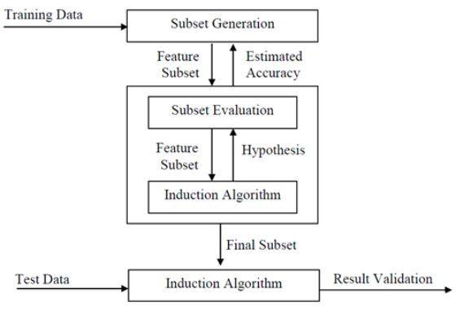

#  学习目标
*https://shimo.im/docs/xmW2YGeCi4sXNTC6*

1. TF-IDF原理。
2. 文本矩阵化，使用词袋模型，以TF-IDF特征值为权重。（可以使用Python中TfidfTransformer库）
3. 互信息的原理。
4. 使用第二步生成的特征矩阵，利用互信息进行特征筛选。

# 1.TF-IDF原理
TF-IDF（Term Frequency -  Inverse Document Frequency），即“词频-逆文本频率”，是对文本向量化的特征修正。

TF反映了词语在当前文本中的频率统计，IDF反映了词语在所有文本中频率统计。（一个极端的情况，如果一个词在所有的文本中都出现，那么它的IDF值应该为0。）

**【注意】**  
当使用词频向量化后，可以使用TF-IDF进行特征的权重修正，并标准化后，我们就可以使用各个文本的词特征向量作为文本的特征，进行分类或聚类分析。  
但是如果采用的是Hash Trick进行向量化，则一般无法使用TF-IDF了，因为Hash Trick后我们已经无法得到哈希后的各特征的IDF值。

# 2.文本矩阵化（词袋模型为例）
可以直接使用sklearn实现，代码详见 *text-represent.ipynb*

# 3.互信息原理
点互信息（Pointwise Mutal Information），用来衡量两个事物之间的相关性。

类似于余弦相似度。  
在概率论中，我们知道，如果x跟y不相关，则p(x,y)=p(x)p(y)。二者相关性越大，则p(x, y)就相比于p(x)p(y)越大。用后面的式子更好理解，在y出现的情况下x出现的条件概率p(x|y)除以x本身出现的概率p(x)，自然就表示x跟y的相关程度。

举个自然语言处理中的例子来说，我们想衡量like这个词的极性（正向情感还是负向情感）。我们可以预先挑选一些正向情感的词，比如good。然后我们算like跟good的PMI。

互信息（Mutal Information），即考虑所有数据，是对X和Y所有可能的取值情况的PMI的加权和：  
		

其衡量的是两个随机变量之间的相关性，即一个随机变量中包含的关于另一个随机变量的信息量。所谓的随机变量，即随机试验结果的量的表示，可以简单理解为按照一个概率分布进行取值的变量，比如随机抽查的一个人的身高就是一个随机变量。

在sklearn中可以直接求MI：  
	
	from sklearn import metrics as mr
	mr.mutal_info.score(x, y)
	# 计算x和y的互信息，其中x、y为list或array

## 应用
1、文本自动摘要   
2、两个词语同时出现的概率   
3、特征提取时特征项与类别的关联程度   

# 4.特征选择
常见的方法包括过滤法（Filter）、包裹法（Warpper）、嵌入法（Embedding）。

**1.过滤法**  
过滤法只用于检验特征向量和目标（响应变量）的相关度，不需要任何的机器学习的算法，不依赖于任何模型，只是应用统计量做筛选：我们根据统计量的大小，设置合适的阈值，将低于阈值的特征剔除。我们只在过滤之后的特征子集上进行建模和训练。

过滤法应用于回归问题，还可以采用Pearson相关系数、互信息法（Mutual Information ），应用分类问题则可以使用卡方检验（Chi-Squared Test ）。

**2.包裹法**  
与过滤法不同的是，包裹法采用的是特征搜索的办法。它的基本思路是，从初始特征集合中不断的选择子集合，根据学习器的性能来对子集进行评价，直到选择出最佳的子集。在搜索过程中，我们会对每个子集做建模和训练。

常使用的是贪心算法：前向搜索（Forward search）、后向搜索（Backward search）、双向搜索（Bidirectional search）和递归剔除（Recursive elimination ）

**3.嵌入法**  
仔细思考前两种方法，过滤法与学习器没有关系，特征选择只是用统计量做筛选，而包裹法则固定了学习器，特征选择只是在特征空间上进行搜索。而嵌入法最大的突破在于，特征选择会在学习器的训练过程中自动完成。

嵌入法是通过降低权重系数的办法来对特征做筛选，从而达到降低过拟合。

**正则化的方法就是一种标准的嵌入法。** （决策树）

---------------------------------------
## Ref：
1.[博客：文本挖掘预处理之TF-IDF](https://www.cnblogs.com/pinard/p/6693230.html)

2.[简书：使用不同的方法计算TF-IDF值](https://www.jianshu.com/p/f3b92124cd2b)

3.[CSDN：sklearn-点互信息和互信息](https://blog.csdn.net/u013710265/article/details/72848755)

4.[百度：如何进行特征选择（理论篇）机器学习你会遇到的“坑”](https://baijiahao.baidu.com/s?id=1604074325918456186&wfr=spider&for=pc)

